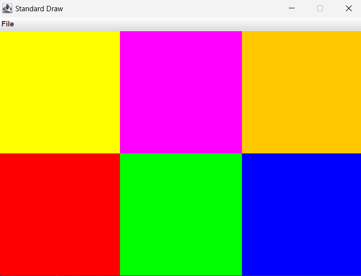

# I2CS_Ex2 - 2D Maze & Image Algorithms

## 1. Project Overview
This project, developed as part of the **Introduction to Computer Science** course at Ariel University (2026), explores Object-Oriented Programming (OOP) through the lens of image processing and maze-solving algorithms.

The core of the assignment is implementing a 2D map system (`Map2D`) that represents a grid-based environment. The system supports various operations, from basic geometric drawing to complex pathfinding and connectivity algorithms based on **Breadth-First Search (BFS)**.

---

## 2. Key Focus Areas
* **OOP Principles:** Interface implementation, encapsulation, and deep copying.
* **Graph Algorithms:** Utilizing BFS for shortest paths and area filling.
* **Data Structures:** Using Queues and 2D arrays efficiently.
* **Unit Testing:** Comprehensive testing using JUnit to ensure code reliability.

---

## 3. Class Descriptions & Functionalities

### Index2D
A fundamental class representing a 2D point $(x, y)$ on the grid.
* **getX / getY:** Retrieve coordinates.
* **distance2D:** Calculates the Euclidean distance between two points.
* **equals / toString:** Standard methods for object comparison and string representation.

### Map (Implementing Map2D)
The engine of the project. It handles both data storage and algorithmic logic.

#### **Basic Operations:**
* **init:** Initializes the map with dimensions and a default value, or from an existing array (deep copy).
* **getMap:** Returns a deep copy of the internal 2D array.
* **getPixel / setPixel:** Access and modify specific coordinates.
* **rescale:** Resizes the map while maintaining the relative structure.

#### **Drawing Tools:**
* **drawRect:** Fills a rectangular area defined by two points.
* **drawCircle:** Fills a circular area based on a center point and radius.
* **drawLine:** Draws a line between two points using linear approximation and rounding.

#### **Advanced Algorithms:**
* **fill:** A "Bucket Fill" algorithm that colors a connected component of the same color starting from a point.
* **allDistance:** Generates a distance map from a start point to all reachable cells, avoiding obstacles.
* **shortestPath:** Finds the actual sequence of pixels representing the shortest valid path between two points.

---

## 4. How to Run
1.  Clone the repository.
2.  Ensure you have the `StdDraw` library (included) for the GUI.
3.  Run `Ex2_GUI` to see the visual representation of the maze and algorithms.
4.  Run the JUnit tests in `Index2DTest` and `MapTest` to verify logic.
